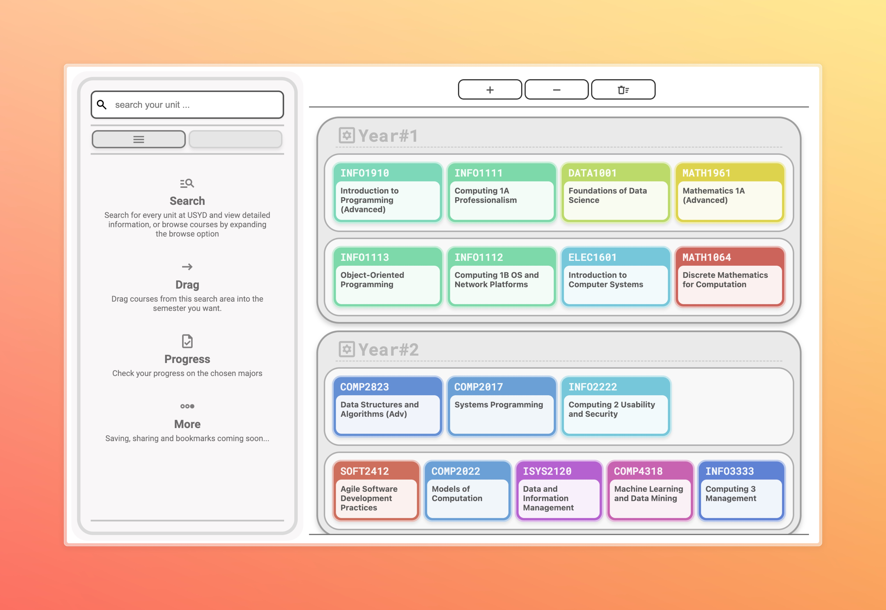

# Building the new CUSP/Unit of Study Selection Helper - USYD TABS v2 merged! (Name not finalised)
---
README 30th Jul 2024 - hey! new sem.. how nice..?
use the planner: https://tabs-usyd.vercel.app/
### Why we even need a new CUSP/Planner anyway?
In short, the current sites are pretty bad (at least in terms of own planning imo). This system is more meant to be a planner skeleton with some simple prerequisite / co-req / prohibs detections. The coverage of unit is not 100% but currently pretty usuable from my perspective, if you have any suggestion on this feel free to contact me.
(somehow there's a 3888 project on course planning.. very cool stuff, I might want official data support from the uni if possible, currently they are all scrapped from uni websites.. and all those creepy descriptions and prereqs were driving me crazy.)

---
# Access and setups:
this repo (usually the latest): https://tabs-usyd.vercel.app/
coding fest edition: https://definitely-not-cusp.vercel.app/

### Overlook at the page:

### Course Selection Area:
- Year and Semester Layout: The system organises courses into "Year 1," "Year 2," etc., further subdivided into semesters, the setting for each year is where you can modify which semester to display - this is for students taking intensive sems / gap year or semesters. The prerequisite and etc. control is still up for these extra periods, but they are not guaranteed to be accruate.
- The buttons on the top are for amount of yr control - pretty obvious - the bin button is for cleaning the whole plan, sorry for not having an extra warning YET but I hope not a lot of ppl are misclicking it.
- Drag any unit you searched up / filtered by degree or major cores into the table. The plan will automatically stored in your browser localstorage so don't worry about it too much. Sadly I'm not supporting this planner with a proper backend currently so if you wish to view the same plan on your laptop and mobile devices it might be a bit tedious to make 2 plans, I might work on an simple account support (or some clipboard magic for you to easily get your plan into another device easily)
- The prerequisites detection is modified using the prereqs given by the uni websites, some of those units have these descriptions totally not processable, so some units having such "complete 12cp of 2000 level of XXXX units" might cause some false warning, you may ignore the warning if you want by clicking on the unit block, there's a little toggle in the planel of that specific unit.

### Sidebar:
- A search box, swiftly locate specific course units by keyword...! This can be the unit code or the unit name.
- A browse button under the searching functionality - plenty of majors / degrees scrapped from uni sites in a very unplesent way, good luck finding yours.
